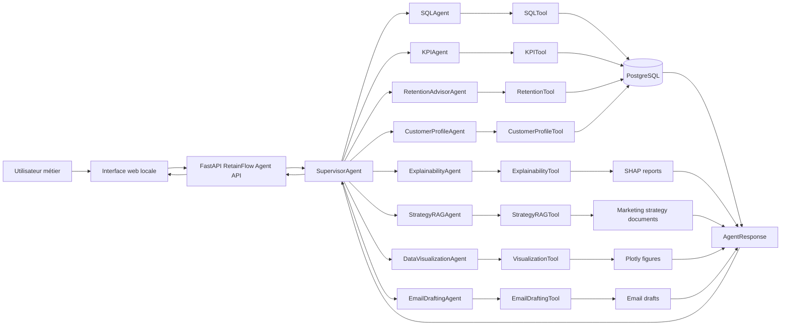
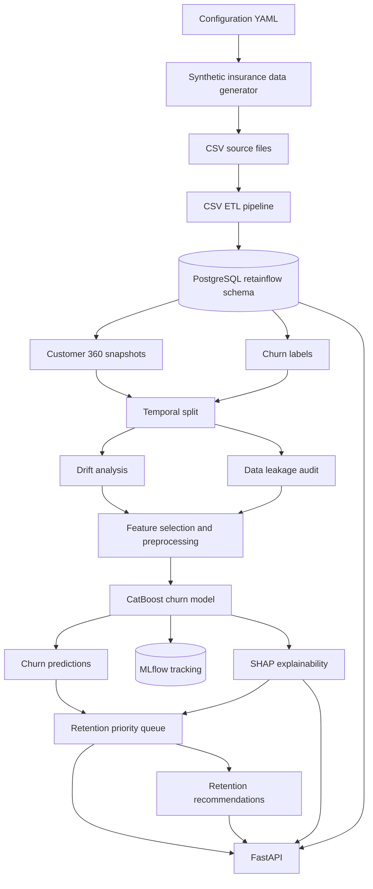

# RetainFlow

RetainFlow est un projet data science et agentique autour d'une question métier simple :

> Quels clients risquent de résilier leur contrat d'assurance, pourquoi, et quelles actions concrètes un conseiller peut-il engager pour les retenir ?

Le projet met en place une chaîne complète : une base PostgreSQL locale, un modèle de churn, de l'explicabilité, des recommandations de rétention et une interface agentique pour interroger le système en langage naturel.

L'objectif n'est pas seulement de produire un score. L'objectif est d'aider un conseiller, un gestionnaire ou une équipe métier à comprendre les clients prioritaires, à justifier les décisions et à choisir une action adaptée.

## Présentation Du Projet

RetainFlow est une plateforme analytique et agentique pour la rétention client dans l'assurance. Elle simule un système d'information assurance complet, entraîne un modèle de prédiction du churn, explique les facteurs de risque avec SHAP, construit une file de clients prioritaires et expose le tout dans une interface web locale pilotée par une API FastAPI.

Le projet couvre le cycle complet d'un cas d'usage data science métier :

- génération d'un dataset assurance réaliste ;
- chargement des données dans PostgreSQL ;
- construction d'un snapshot analytique client 360 ;
- entraînement d'un modèle CatBoost pour prédire le churn ;
- suivi des expériences avec MLflow ;
- analyse du drift et du data leakage ;
- génération d'explications SHAP ;
- priorisation des clients à contacter ;
- recommandation d'actions de rétention ;
- interrogation du système avec des agents SQL, KPI, RAG, visualisation et email.

RetainFlow est donc à la fois un projet machine learning, un socle data engineering local, et une première version d'assistant métier capable de transformer des prédictions en décisions actionnables.

## Problématique

Dans une compagnie d'assurance, une résiliation est rarement causée par un seul événement. Elle peut venir d'une hausse de prime, d'un sinistre mal vécu, d'un paiement rejeté, d'une faible interaction avec l'agence, d'une pression concurrentielle ou d'un manque de réponse commerciale.

RetainFlow cherche donc à répondre à ces questions :

- quels clients présentent le plus fort risque de churn ;
- quels signaux expliquent ce risque ;
- quelles agences, régions ou segments sont les plus exposés ;
- quelles actions de rétention sont les plus pertinentes ;
- comment rendre les résultats compréhensibles pour un utilisateur métier.

## Vision Du Projet

Un utilisateur métier doit pouvoir poser une question naturelle, par exemple :

```text
Quels sont les 5 clients à contacter en urgence et pourquoi ?
```

RetainFlow doit alors :

1. comprendre l'intention de la question ;
2. interroger PostgreSQL si des données sont nécessaires ;
3. récupérer les clients prioritaires ;
4. exploiter les prédictions du modèle de churn ;
5. ajouter les explications SHAP disponibles ;
6. consulter les documents de stratégie marketing si besoin ;
7. retourner une réponse claire, avec tableau, graphique ou brouillon d'email.

## Ce Que Contient RetainFlow

**Une base de données assurance**

La base PostgreSQL locale représente un système d'information assurance centré sur la France : clients, agences, conseillers, contrats, produits, paiements, sinistres, interactions, campagnes marketing, devis concurrents et actions de rétention.

**Un modèle de churn**

Le modèle actuel utilise CatBoost. Le pipeline prend en compte le split temporel, le drift, le data leakage, le preprocessing, le feature engineering, l'entraînement, l'évaluation, le seuil de décision et le suivi MLflow.

**Une couche d'explicabilité**

Les rapports SHAP permettent d'expliquer les facteurs qui influencent les prédictions. L'idée est de répondre à la question : pourquoi ce client est-il considéré à risque ?

**Des recommandations métier**

RetainFlow construit une file de clients prioritaires et propose des actions de rétention lisibles : canal recommandé, justification, prochaine action et brouillon de message.

**Des agents**

La couche agentique transforme le projet en assistant interactif. Les agents peuvent interroger SQL, produire des KPI, rechercher dans les documents marketing, générer des graphiques, expliquer une prédiction ou rédiger un email.

## Architecture



## Pipeline Data Et Machine Learning



Lecture rapide :

- l'interface web envoie les questions métier à l'API FastAPI ;
- le `SupervisorAgent` choisit les agents nécessaires selon l'intention ;
- les agents utilisent des tools contrôlés pour interroger PostgreSQL, lire les artefacts SHAP, rechercher dans les documents RAG ou générer un graphique ;
- le pipeline data/ML prépare les données, entraîne CatBoost, produit les prédictions et alimente les tables de rétention utilisées par les agents.

## Structure Du Projet

```text
RetainFlow/
├── app/                  interface web locale
├── config/               configuration YAML
├── data/                 données raw, processed et documents RAG
├── docs/                 documentation du projet
├── logs/                 logs locaux du projet
├── notebooks/            notebooks étape par étape
├── reports/              tableaux, figures et rapports générés
├── scripts/              scripts utilitaires
├── sql/                  schéma PostgreSQL
├── src/retainflow/       code Python de production
└── tests/                tests automatisés
```

Les dossiers historiques ou non essentiels ont été retirés afin de garder une architecture plus claire.

## Interface Agentique

RetainFlow propose une interface web locale pour tester les agents.

Elle permet de :

- poser une question métier ;
- afficher une réponse structurée ;
- consulter les lignes SQL retournées ;
- voir les métadonnées de raisonnement ;
- afficher des graphiques Plotly ;
- obtenir des brouillons de message ;
- suivre les agents mobilisés dans le workflow.

## Agents Créés

La couche agentique de RetainFlow est organisée autour d'un `SupervisorAgent` qui reçoit une question métier, identifie l'intention, appelle les bons agents spécialisés, puis retourne une réponse structurée avec les données, les traces SQL, les explications ou les visuels nécessaires.

Les agents créés dans le projet sont :

| Agent | Rôle |
| --- | --- |
| `SupervisorAgent` | Route les questions vers les agents adaptés et compose la réponse finale. |
| `SQLAgent` | Traduit les questions courantes en requêtes SQL contrôlées et interroge PostgreSQL en lecture seule. |
| `KPIAgent` | Calcule des indicateurs métier : churn rate, clients prioritaires par région/agence, actions recommandées. |
| `RetentionAdvisorAgent` | Récupère les clients les plus urgents à contacter et les recommandations de rétention associées. |
| `CustomerProfileAgent` | Assemble le profil 360 d'un client précis avec contexte contrat, risque, priorité et recommandation. |
| `ExplainabilityAgent` | Lit les artefacts SHAP pour expliquer les facteurs globaux qui influencent le modèle de churn. |
| `StrategyRAGAgent` | Recherche dans les documents marketing internes pour proposer des leviers de rétention adaptés. |
| `DataVisualizationAgent` | Transforme les résultats SQL ou KPI en graphiques Plotly exploitables dans l'interface. |
| `EmailDraftingAgent` | Génère un brouillon d'email ou de message conseiller à partir d'une recommandation de rétention. |

Tous les agents retournent un objet commun `AgentResponse`, ce qui permet à l'API FastAPI et au frontend de manipuler de la même façon une table SQL, un graphique Plotly, une réponse textuelle, une explication SHAP ou un brouillon d'email.

## Corrective RAG

RetainFlow utilise un RAG local sur le corpus `data/docs/strategy_marketing`. Le retriever commence par rechercher les documents les plus proches de la question utilisateur, puis applique une logique corrective si les résultats sont faibles.

Le workflow est le suivant :

1. recherche initiale avec TF-IDF ;
2. évaluation du score de pertinence ;
3. enrichissement de la requête avec du vocabulaire assurance-rétention si le score est insuffisant ;
4. seconde recherche sur la requête corrigée ;
5. retour des documents avec les métadonnées `retrieval_status`, `corrected`, `original_query` et `corrected_query`.

Le corpus contient des fiches métier structurées pour plusieurs situations de churn : sensibilité prix, insatisfaction service, incidents de paiement, renouvellement proche, réengagement digital, sinistre récent et client haute valeur.

## Configuration LLM Et APIs

RetainFlow charge automatiquement les variables présentes dans `.env`. Le supervisor peut utiliser un LLM pour classifier l'intention d'une question métier avant d'appeler les agents spécialisés.

Variables principales :

```text
RETAINFLOW_LLM_ENABLED=true
LLM_PROVIDER=groq
LLM_MODEL=llama-3.3-70b-versatile
GROQ_API_KEY=...
```

Le LLM ne remplace pas les guardrails du projet : il choisit le workflow à lancer, mais les requêtes SQL passent toujours par `SQLTool`, les KPI par `KPITool`, les recommandations par `RetentionTool`, et les visuels par `VisualizationTool`.

Services optionnels prévus dans `.env.example` :

- `OPENAI_API_KEY` si vous voulez utiliser OpenAI à la place de Groq ;
- `GOOGLE_API_KEY` et `HUGGINGFACE_API_KEY` pour de futurs embeddings ou rerankers ;
- `PINECONE_API_KEY` pour remplacer plus tard le RAG local TF-IDF par un index vectoriel ;
- `LANGFUSE_*` pour ajouter de l'observabilité lorsque l'intégration sera activée.

## Lancer Le Projet

Installer les dépendances :

```bash
poetry install
```

Démarrer PostgreSQL :

```bash
docker compose up -d postgres
```

Lancer l'API :

```bash
poetry run retainflow-api
```

Dans un deuxième terminal, lancer l'interface :

```bash
python -m http.server 5500 --directory app
```

Ouvrir ensuite :

```text
http://127.0.0.1:5500
```

## Commandes Utiles

Construire ou reconstruire les données :

```bash
poetry run retainflow-build-data --reset --n-customers 10000
```

Créer le dashboard de drift :

```bash
poetry run retainflow-drift-dashboard --config config/churn_model.yml
```

Entraîner le modèle :

```bash
poetry run retainflow-train-churn --config config/churn_model.yml
```

Construire la file de rétention :

```bash
poetry run retainflow-build-retention-queue --config config/churn_model.yml
```

Générer les recommandations :

```bash
poetry run retainflow-build-retention-recommendations --config config/churn_model.yml
```

## MLflow

RetainFlow utilise un MLflow local centralisé afin de suivre les expériences, les métriques, les modèles et les artefacts.

La configuration se trouve dans :

```text
config/churn_model.yml
```
