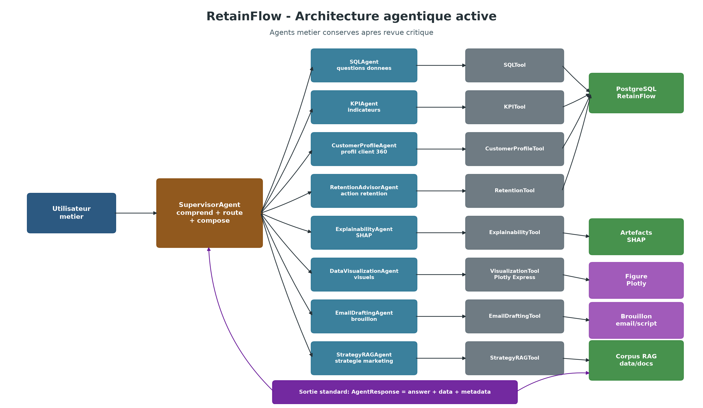
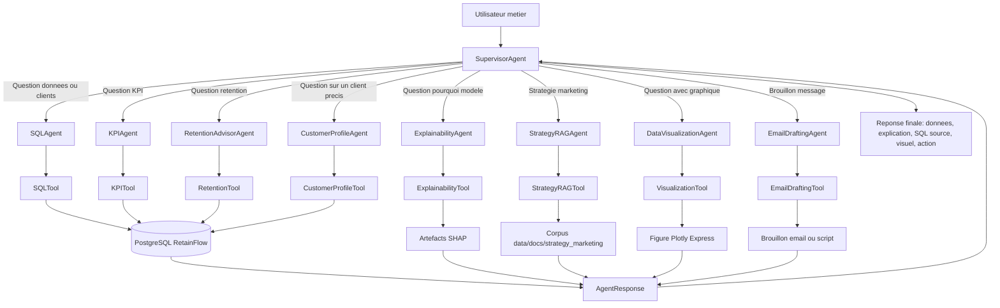
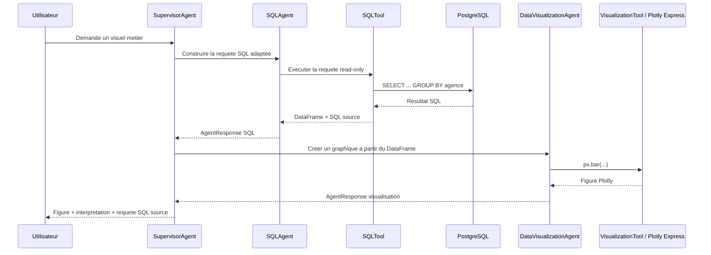
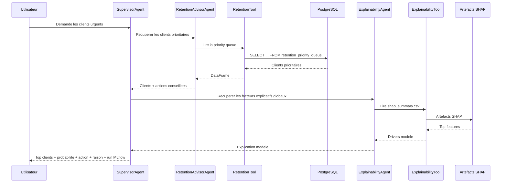

# RetainFlow - Fonctionnement Du Dossier `src/retainflow/agents`

## 1. Role Du Dossier

Le dossier `src/retainflow/agents` contient les classes qui orchestrent le raisonnement metier de RetainFlow.

Un agent ne doit pas etre vu comme une simple fonction Python. Dans ce projet, un agent est une classe qui:

- comprend une intention metier;
- choisit le bon outil;
- organise les etapes;
- retourne une reponse structuree;
- conserve les traces utiles dans `metadata`.

La logique concrete d'execution reste dans `src/retainflow/tools`.

```text
Agent = decide quoi faire, dans quel ordre, et comment expliquer le resultat.
Tool  = execute une action concrete: SQL, KPI, visualisation, email, SHAP, etc.
```

Cette separation est importante parce qu'elle permet ensuite de brancher un LLM sans casser le projet. Le LLM pourra aider a comprendre une question libre, mais les actions sensibles resteront controlees par les tools.

## 2. Architecture Globale

Le schema ci-dessous montre le fonctionnement general.





Lecture du schema:

- l'utilisateur pose une question metier;
- le `SupervisorAgent` decide quels agents appeler;
- les agents utilisent des tools pour executer les actions;
- les tools vont chercher les donnees dans PostgreSQL, les artefacts SHAP ou le corpus RAG;
- chaque agent retourne un `AgentResponse`;
- le supervisor compose la reponse finale.

## 3. Flux Avec Visualisation

Exemple de demande:

```text
Visualise le taux de clients contactes cette semaine par agence.
```



Ce flux est important parce qu'il montre que le graphique n'est pas invente. Il vient d'une requete SQL executee, puis transformee en `DataFrame`, puis visualisee avec Plotly Express.

## 4. Flux Avec Retention Et Explicabilite

Exemple de demande:

```text
Quels sont les 5 clients a contacter en urgence et pourquoi ?
```



Dans la version actuelle, l'explicabilite est globale. La prochaine etape sera d'ajouter une table d'explicabilite locale par client.

## 5. Structure Actuelle

```text
src/retainflow/agents/
  __init__.py
  base.py
  supervisor.py
  sql_agent.py
  kpi_agent.py
  data_visualization_agent.py
  retention_advisor_agent.py
  explainability_agent.py
  customer_profile_agent.py
  email_drafting_agent.py
  strategy_rag_agent.py
```

## 6. Objet Commun `AgentResponse`

Fichier:

```text
src/retainflow/agents/base.py
```

Toutes les classes agents retournent un objet `AgentResponse`.

```python
AgentResponse(
    agent_name="SQLAgent",
    answer="Requete executee avec 5 lignes retournees.",
    data=df,
    metadata={
        "sql": "...",
        "row_count": 5,
    },
)
```

Role des champs:

- `agent_name`: nom de l'agent qui a produit la reponse;
- `answer`: texte court comprehensible par un humain;
- `data`: resultat exploitable, par exemple un `DataFrame`, une figure Plotly ou un brouillon d'email;
- `metadata`: traces techniques, comme la requete SQL, le nombre de lignes ou le chemin d'un artefact.

Ce format commun est volontaire. Il permet au notebook, a une future API ou au supervisor de manipuler tous les agents de la meme maniere.

## 7. `SupervisorAgent`

Fichier:

```text
src/retainflow/agents/supervisor.py
```

Le `SupervisorAgent` est le routeur principal. C'est lui qui recoit une question metier et decide quel workflow executer.

Il coordonne:

- `SQLAgent`;
- `KPIAgent`;
- `RetentionAdvisorAgent`;
- `ExplainabilityAgent`;
- `CustomerProfileAgent`;
- `DataVisualizationAgent`;
- `EmailDraftingAgent`.

Exemple:

```python
response = supervisor.answer(
    "Visualise le taux de clients contactes cette semaine par agence",
    limit=20,
)
```

Ce que fait le supervisor:

```text
1. Il detecte le mot "visualise".
2. Il appelle SQLAgent pour produire et executer une requete SQL.
3. Il passe le DataFrame au DataVisualizationAgent.
4. Il retourne une figure Plotly + la requete SQL source.
```

Exemple de `metadata` retournee:

```python
{
    "steps": ["SQLAgent", "DataVisualizationAgent"],
    "sql": "...",
    "visualization": {
        "chart_type": "bar",
        "title": "...",
    },
}
```

Pour le moment, le supervisor utilise une logique simple basee sur des mots-cles:

```text
graph, plot, visuel, visualise -> SQLAgent + DataVisualizationAgent
email, mail, message           -> RetentionAdvisorAgent + EmailDraftingAgent
kpi, taux, volume, repartition -> KPIAgent
customer_id CUST_...           -> CustomerProfileAgent + ExplainabilityAgent
sinon                          -> RetentionAdvisorAgent + ExplainabilityAgent
```

Plus tard, cette logique pourra etre remplacee ou enrichie par un LLM.

## 8. `SQLAgent`

Fichier:

```text
src/retainflow/agents/sql_agent.py
```

Le `SQLAgent` transforme une question metier en requete SQL controlee.

Il ne se connecte pas directement a PostgreSQL. Il delegue l'execution au `SQLTool`.

Exemple:

```python
sql_response = sql_agent.answer(
    "Quels sont les clients a contacter en urgence ?",
    limit=5,
)
sql_response.data
```

Le resultat est un `DataFrame` avec les clients prioritaires:

```text
customer_id
first_name
last_name
region
agency_name
priority_tier
priority_score
churn_probability
expected_saved_value
recommended_action_type
recommended_channel
action_reason
mlflow_run_id
```

Le `SQLAgent` sait actuellement choisir entre plusieurs templates:

- top clients prioritaires;
- clients prioritaires par region;
- distribution des actions recommandees;
- clients a contacter cette semaine par agence.

Important:

Le `SQLAgent` construit la requete, mais c'est `SQLTool` qui bloque les requetes dangereuses. Cette securite evite qu'un futur LLM execute une requete de modification par erreur.

## 9. `KPIAgent`

Fichier:

```text
src/retainflow/agents/kpi_agent.py
```

Le `KPIAgent` repond aux questions d'indicateurs metier.

Il utilise `KPITool`, qui contient les requetes KPI predefinies.

Questions typiques:

```text
Montre le taux de churn par split.
Quel est le volume de clients prioritaires par region ?
Quelles agences ont le plus de clients a risque ?
Quelle est la repartition des actions recommandees ?
```

Exemple:

```python
kpi_response = kpi_agent.answer(
    "Montre le volume de clients prioritaires par region"
)
kpi_response.data
```

Sortie:

- texte court dans `answer`;
- table KPI dans `data`;
- requete SQL source dans `metadata["sql"]`.

## 10. `DataVisualizationAgent`

Fichier:

```text
src/retainflow/agents/data_visualization_agent.py
```

Cet agent cree des graphiques a partir d'un `DataFrame`.

Il utilise:

```text
src/retainflow/tools/visualization_tool.py
```

La librairie prioritaire est Plotly Express.

Exemple:

```python
visual_response = visualization_agent.answer(
    "Visualise les clients prioritaires par region",
    kpi_response.data,
)
visual_response.data.show()
```

Dans cet exemple:

- `kpi_response.data` est le `DataFrame`;
- `DataVisualizationAgent` choisit automatiquement un graphique;
- `VisualizationTool` produit une figure Plotly;
- `visual_response.data` contient la figure.

On peut aussi forcer un bar plot:

```python
visual_response = visualization_agent.bar(
    dataframe=df,
    x="region",
    y="clients",
    color="priority_tier",
    title="Clients prioritaires par region",
)
visual_response.data.show()
```

Ce fonctionnement est tres important pour ton cas d'usage:

```text
Utilisateur:
"Montre-moi le taux de clients contactes cette semaine par agence."

SQLAgent:
recupere les chiffres dans PostgreSQL.

DataVisualizationAgent:
genere un bar plot interactif.

SupervisorAgent:
retourne le graphique + interpretation + SQL source.
```

## 11. `RetentionAdvisorAgent`

Fichier:

```text
src/retainflow/agents/retention_advisor_agent.py
```

Cet agent lit les resultats metier de retention deja produits par les pipelines:

```text
retainflow.retention_priority_queue
retainflow.retention_recommendation
```

Il utilise:

```text
src/retainflow/tools/retention_tool.py
```

Methodes principales:

```python
retention_agent.top_clients(limit=5)
retention_agent.top_recommendations(limit=5)
```

`top_clients` retourne les clients les plus urgents:

- probabilite de churn;
- score de priorite;
- valeur sauvee attendue;
- action conseillee;
- canal conseille;
- raison metier.

`top_recommendations` retourne les recommandations pretes pour revue humaine:

- offre recommandee;
- message conseiller;
- justification;
- prochaine etape;
- statut de validation humaine.

## 12. `ExplainabilityAgent`

Fichier:

```text
src/retainflow/agents/explainability_agent.py
```

Cet agent expose les explications SHAP du modele.

Il utilise:

```text
src/retainflow/tools/explainability_tool.py
```

Artefacts lus:

```text
reports/tables/shap_summary.csv
reports/tables/shap_agent_report.json
```

Exemple:

```python
explainability_response = explainability_agent.global_drivers(top_n=10)
explainability_response.data
```

Pour le moment, l'agent retourne les facteurs globaux du modele.

Evolution importante a faire ensuite:

```text
Creer des explications SHAP locales par client.
```

Cela permettra de repondre a:

```text
Pourquoi ce client precis risque de churner ?
```

avec une reponse du type:

```text
Le risque augmente principalement a cause des incidents de paiement,
de la hausse de prime et d'une satisfaction faible.
```

## 13. `EmailDraftingAgent`

Fichier:

```text
src/retainflow/agents/email_drafting_agent.py
```

Cet agent genere un brouillon d'email ou de message conseiller.

Il utilise:

```text
src/retainflow/tools/email_tool.py
```

Exemple:

```python
email_response = email_agent.draft_first(advisor_response.data)
email_response.data
```

La sortie contient:

- un objet;
- un sujet;
- un corps de message;
- le canal;
- `requires_human_approval=True`.

Point important:

L'agent ne doit jamais envoyer l'email automatiquement. Il produit uniquement un brouillon a valider.

## 14. `CustomerProfileAgent`

Fichier:

```text
src/retainflow/agents/customer_profile_agent.py
```

Cet agent recupere le contexte complet d'un client precis.

Il utilise:

```text
src/retainflow/tools/customer_profile_tool.py
```

Exemple:

```python
profile_response = customer_profile_agent.by_customer_id("CUST_000123")
profile_response.data
```

Le resultat regroupe:

- informations client;
- agence et region;
- dernier snapshot analytique;
- prediction churn;
- priorite retention;
- recommandation;
- message conseiller si disponible.

Cet agent est plus pertinent que l'ancien `ChurnModelAgent`, parce qu'un conseiller ne demande presque jamais "donne-moi seulement la prediction brute". Il demande plutot: "explique-moi ce client et dis-moi quoi faire".

## 15. `StrategyRAGAgent`

Fichier:

```text
src/retainflow/agents/strategy_rag_agent.py
```

Cet agent recherche dans des documents locaux de strategie retention.

Dossier cible:

```text
data/docs/strategy_marketing
```

Exemple:

```python
rag_response = rag_agent.search(
    "Quelle strategie appliquer pour un client sensible au prix ?"
)
rag_response.data
```

Pour le moment, la recherche est locale et deterministe:

- lecture de fichiers `.md` et `.txt`;
- vectorisation TF-IDF;
- similarite cosinus entre la question et les documents;
- classement par score.

Evolution prevue:

```text
1. Ajouter embeddings.
2. Ajouter vector store.
3. Citer les sources.
4. Integrer les documents produits, offres, conformite, scripts commerciaux.
```

## 16. Agents Retires De La Version Active

J'ai volontairement retire deux agents de la version active.

```text
ChurnModelAgent
DataQualityAgent
```

Raison:

- `ChurnModelAgent` etait trop faible: il lisait seulement les predictions deja stockees. Cette responsabilite doit devenir un vrai `ModelTool` ou une API modele, pas un agent autonome.
- `DataQualityAgent` est utile, mais moins central pour un conseiller metier. Les rapports drift/leakage doivent rester disponibles comme garde-fous internes, puis etre appeles par le supervisor quand une question porte sur la fiabilite.

Ces capacites ne sont pas abandonnees. Elles sont simplement mieux placees comme tools, services ou controles internes.

## 17. `__init__.py`

Fichier:

```text
src/retainflow/agents/__init__.py
```

Ce fichier expose les agents pour simplifier les imports dans les notebooks.

Au lieu de faire:

```python
from retainflow.agents.supervisor import SupervisorAgent
from retainflow.agents.sql_agent import SQLAgent
from retainflow.agents.kpi_agent import KPIAgent
```

on peut faire:

```python
from retainflow.agents import SupervisorAgent, SQLAgent, KPIAgent
```

## 18. Workflow Principal Dans Le Notebook

Notebook:

```text
notebooks/05_agentic_retention_workflow.ipynb
```

Workflow:

```text
1. Charger config/churn_model.yml.
2. Initialiser les agents.
3. Poser une question SQL.
4. Afficher le DataFrame.
5. Afficher la requete SQL source.
6. Calculer un KPI.
7. Visualiser le KPI avec Plotly.
8. Appeler le supervisor pour une demande complete.
9. Lire les recommandations.
10. Lire SHAP global.
11. Generer un brouillon d'email.
```

Exemple:

```python
supervisor_response = supervisor.answer(
    "Visualise le taux de clients contactes cette semaine par agence",
    limit=20,
)
supervisor_response.data.show()
```

## 19. Limites De La Version Actuelle

Cette premiere version est volontairement deterministe.

Cela veut dire:

- pas encore de LLM actif;
- pas encore de vrai text-to-SQL libre;
- pas encore de model serving FastAPI;
- pas encore de SHAP local par client;
- pas encore de vector database pour le RAG.

Mais la structure est deja prete pour ajouter ces briques proprement.

## 20. Prochaine Etape Logique

La suite la plus pertinente est:

```text
1. Ajouter un vrai ExplainabilityTool local par client.
2. Creer la table retainflow.churn_prediction_explanation.
3. Ajouter ModelTool pour charger le modele depuis MLflow.
4. Creer une API FastAPI locale.
5. Brancher un LLM sur SupervisorAgent et SQLAgent.
6. Garder SQLTool comme garde-fou obligatoire.
```

Le point cle est celui-ci:

```text
Les agents raisonnent.
Les tools executent.
Le supervisor orchestre.
Le metier garde la validation finale.
```
